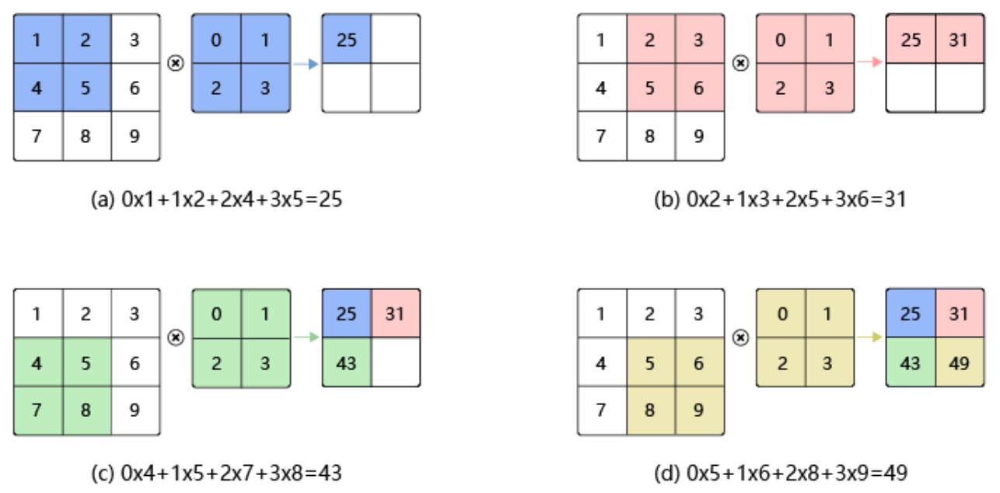

## 什么是神经网络

### 神经网络的简单定义

神经网络是由**包含或不包含参数的简单处理单元**相互连接构成的**大规模结构**。它能够**将数据经过由连接和参数决定的流程**进行计算，将输入映射到输出。

### 神经网络能够处理的问题

#### 神经网络方法在人工智能领域的定位

```mermaid
graph LR
A(人工智能) --> B(机器学习)
B --> C(神经网络)
```

#### 神经网络常用来处理什么样的问题

- 从数据中获取并保存信息（数据驱动任务）
- 拥有结构化的、相对大量的结构化输入-输出对数据
- 有明确、可计算的性能评估指标
- 常见的有分类、预测、生成任务

#### 神经网络的优点

- 可以形成拥有大规模参数的结构：信息提取和保存能力强，泛化性能好
- 可扩展性：结构化的输入和输出，便于扩展和复用
- 非线性：从输入特征空间到输出特征空间的映射是非线性的

## 学习任务的组成

### 学习任务

> 学习任务是由**模型 $M$、经验 $E$、任务 $T$、性能量度 $P$** 组成的。模型的学习是指 **模型 $M$ 通过得到经验 $E$，在性能量度 $P$ 意义下相对得到经验 $E$ 并运行学习算法前在任务 $T$ 上有所改进。**

对于神经网络而言，模型 $M$ 即为神经网络本身，经验 $E$ 为数据，性能量度 $P$ 为损失函数，而任务 $T$ 即为希望使用神经网络解决的机器学习问题。

例如：神经网络模型的学习任务是指该神经网络在图像分类任务上进行学习，在获得标注后的图片分类数据并进行训练后，在分类准确率标准下相较于训练前有所提升。

在神经网络学习任务中，我们称使用数据作为经验 $E$，对神经网络使用学习算法进行优化的过程为**训练**。

### 数据与经验

对任务 $T$ 进行数学建模：

>对于某个样本空间已知而概率未知的概率空间 $(\Omega, \cal{F}, \cal{P})$，希望通过独立同分布的采样结果$\{X_i\} \sim \mathcal{P}(x)$ 估计分布 $\mathcal{P}$。我们称采样结果 $\{X_i\}$ 为**数据**

从中可以得到几个数据驱动机器学习任务的经典假设：

1. 真实分布假设：认为数据符合某个确定的真实分布
2. 独立同分布假设：认为数据是从真实分布中独立同分布采样的
3. 低维流形假设：自然的原始数据是低维的流形嵌入于原始数据所在的高维空间（因为我们无法通过有限空间和时间估计无穷维样本空间上的概率分布）

### 损失函数与性能量度

我们需要一个能够不需要人类参与的性能度量算法，以便神经网络自行迭代而无需人类的干预，从而显著提升效率。

通常来说，性能量度 $P$ 是特定于任务 $T$ 而言的。而由于人类经验的复杂性，我们通常只能够近似地评估模型的性能。在神经网络学习任务中，性能量度 $P$ 被称为损失函数：

#### 损失函数

> 对于给定的模型 $M$，和给定的经验 $E$，损失函数定义为函数
> $$
> \mathcal{L}:(M, E) \to \mathbb{R}.
> $$
> **损失函数值越大，代表人类认为模型 $M$ 在任务 $T$ 上的表现与经验 $E$ 的表现差距越大。**

比如，在图像分类任务中，$\mathcal{L}(M,E)$ 可以为在某一组标注好类别图像数据上，模型在预测这组图像类别时的错误率。

#### 训练集与测试集

在神经网络的评估中，一个重要的指标是其泛化能力，即对于在经验E没有涉及的、同时位于任务T的样本空间范围内的点的估计效果。通常我们会从训练数据中单独分出一小部分，在训练时不作为样本对模型进行训练，并评估模型在这些样本上的性能。

我们称 **在训练时作为样本对模型进行训练的数据集合为数据集，分出来的那一小部分为测试集**。通常，为了得知模型在训练过程中的性能变化趋势，我们还会从测试集中分出一小部分作为**验证集**，在训练中途多次在验证集上测试模型的性能表现。

## 神经网络的构成

我们在第一节强调了神经网络构成的两个部分：带参数或不带参数的简单结构，以及它们的连接。在本节中将详细说明这两部分。

### 感知机
线性感知机算法（PLA）1957 年由 Frank Rosenblatt 提出。感知机是二分类的线性分类模型，其输入为实例的特征向量，输出为实例的类别，取值为 $+1$ 和 $-1$。
> perceptron: 
$ f(\vec{x}) = sign(\vec{w}^T \vec{x} + b) $，where $w，x \in \mathbb{R}^n，b \in \mathbb{R}$

显然，这是一个含参数$w$的，且能够将输入根据参数$w$唯一映射到输出的简单结构。

感知机是神经网络中最常使用、最简单的含参结构。虽然感知机只能进行简单的线性可分分类问题，但通过连接大量感知机，以及更换符号函数为其他非线性函数，我们可以构造出复杂的结构。

### 多层感知机MLP
多层感知机是通过感知机的拼接组成的结构。它是最简单的神经网络结构。这个结构在几乎所有的现代深度神经网络中都存在。

> multiple layer perceptron: 
$$ f(\vec{x}) = f_N \circ \dots \circ f_0 $$ $$ f_i(\vec{x}) = \sigma_i(W \vec{x} + \vec{b}) $$
，where $W \in \mathbb{R}^{n_i \times n_{i+1}}，b \in \mathbb{R}^n_{i+1}，i \in \{0，\dots ，N\}$

其结构可以表示为：

其中的$h_i、o_i$代表一个将符号函数替换为非线性激活函数的感知机。（尝试根据图中给出的结构，推导上面给出的公式。进一步的，写出$W_1，W_2$与各感知机参数之间的关系）

我们可以发现，**仅通过连接感知机，我们就获得了一个可以任意增大规模而基础结构相同的，从任意维欧式空间向任意维欧式空间映射的结构。** 注意到，由于引入了非线性激活函数（试想如果使用线性激活函数会怎样？），这个结构还可以表示非线性的映射。于是我们获得了一个典型的神经网络模型。

## 神经网络的学习算法
### 神经网络的优化

在第二节我们探讨了学习任务，并定义了神经网络中的性能量度——损失函数。在上一节，我们获得了一个典型的神经网络模型。在这一章，我们自然需要讨论如何通过使用经验E，即数据，使得神经网络在损失函数意义下获得性能提升。

### 最小化损失函数

注意到损失函数的定义，我们假定了模型性能越差，损失函数越大。也就是说，**我们只需要反过来通过调整M，在经验E上最小化损失函数，就能达到提高模型M在任务T上表现的目的。**于是，神经网络的优化任务可以如下形式化定义：
> $$ \theta^* = \arg \min_\theta \cal{L}(M_\theta，E) $$

其中$\theta$**所有的可调整参数**。通过损失函数，我们成功将主观的性能评估和改进问题，转化为了计算和优化损失函数的问题，进而可以通过数值方法解决。可以认为，通过设计损失函数，我们将主观性转移至了损失函数中。
## 基于梯度的优化方法
在数值计算领域，优化问题的最常用、效果最好的算法绝大部分是基于梯度的算法。由于神经网络的简单基本结构的可导性以及参数空间的连续性，我们可以方便地使用梯度法作为优化方法。

### 梯度下降算法
基于梯度的优化方法中最易理解的是梯度下降算法：
> 令
$$\theta_{n+1} = \theta_n - \eta \frac{\partial \cal{L}(M_{\theta_n}，E)}{\partial \theta_n}$$
则对于一类性质较好的$\cal{L}$和$M_\theta$，我们有
$$ \lim_{\eta \rightarrow 0，n \rightarrow \infty}\theta_n = \theta^* $$

我们知道梯度的反向是该点邻域中函数值下降最快的方向，因此当函数不太差时，沿梯度的反向进行参数的更新都有机会达到函数的最小值。

然而梯度下降算法有两个缺点。首先，该方法对于函数的性质有要求，否则对于参数的初值较为敏感，容易陷入局部极小值。(考虑有两个谷的函数)。其次，该方法需要在全部样本上计算出梯度，并求平均。这极大的降低了梯度下降的效率。

### 随机梯度下降算法(SGD)

随机梯度下降算法是目前几乎所有神经网络的学习算法。目前已知的绝大多数算法都是基于这个方法的优化或微调。或者说，今天我们所讲的神经网络就是指能够使用随机梯度下降算法进行训练的神经网络。
> 令$$ \theta_{n+1} = \theta_{n} - \eta \frac{\partial\cal{L}(M_{\theta_n}，{X_i} \subset E)}{\partial \theta_n} $$
则对于大多数$\cal(L)$和$M_\theta$，我们有
$$ \lim_{\eta \rightarrow 0，n \rightarrow \infty}\theta_n = \theta^* $$


这个算法的证明设计到一些统计知识，在此暂且不证明。(如有兴趣，可以考虑: 1.梯度在样本分布下的无偏估计是什么? 2.考虑使用部分样本进行梯度计算时引入的噪声$\epsilon$。这对于处于局部极小值的参数的梯度计算有什么影响?)

随机梯度下降法使得神经网络能够通过每次选取部分数据计算梯度，即可根据**学习率$\eta$** 更新网络参数

### 梯度的计算方法

理论上，给定任何确定的网络结构，我们都可以写出梯度的解析表达。然而当网络规模增大时，这显然是不可实现的。因此我们需要寻找数值方法计算参数的梯度。

1.数值微分法
>$$ \hat{\theta}_{n+1,i} = \hat{\theta}_{n,i} - \eta\frac{\cal{L}(M_{\hat{\theta}_{n,i} + \epsilon}，{X_i}) - \cal{L}(M_{\hat{\theta}_{n,i} - \epsilon}，{X_i})}{2\epsilon} $$
该方法的时间复杂度是$\cal{O}(N) \times \cal{O}(forward)$，$N$是参数规模。通常来说，$\cal{O}(forward)$ 与参数量成近似线性关系，因此总的复杂度为$\cal{O}(N^2)$。这个复杂度在参数量很大(现代深度神经网络的参数量通常在千万到百亿级别)时是不可接受的。

我们注意到，在进行网络中靠近输出部分的参数的梯度计算时，两次正向传播中有大量的重复计算。因此我们希望寻找一种能够复用计算结果的方法来降低重复计算的开销。

2.反向传播
反向传播法是现有的神经网络计算梯度的最优方法。现代深度神经网络训练框架全部使用反向传播进行梯度计算。

- 链式法则
回顾微积分中的链式法则。
>令
$$f: \mathbb{R}^a \rightarrow \mathbb{R}^b ，g: \mathbb{R}^b \rightarrow \mathbb{R}^c ，c \in \mathbb{R}^a$$，则有
$$ \frac{\partial(g^{(i)}(\vec{f}(\vec{x}))}{\partial x^{(j)}} = \sum_{t = 1}^b \frac{\partial g^{(i)}(f^{(1)}(\vec{x})，\dots，f^{(b)}(\vec{x}))}{\partial f^{(t)}(\vec{x}))}  \frac{\partial f^{(t)}(\vec{x})}{\partial x^{(j)}} $$

可以发现，对于任何完全由复合函数构成的函数，我们都可以将其分为两部分进行计算，这两部分都仅与构成复合函数的部分自身相关。回顾神经网络的定义，我们发现神经网络**确实由这样可导的简单部分相互连接(即复合)构成的**。这表明我们对于神经网络的任意分割，都可以分别计算它们各自的参数的梯度，再将其按照网络结构的连接关系进行组合得到整个网络的参数的梯度。

- 计算图
计算图是一种有向无环图，其中节点表示计算操作，边表示数据流。计算图提供了一种清晰的方式来表示复杂的计算过程，并允许方便的使用使用链式法则来计算梯度

计算图由两部分组成: 节点上的运算(通常用圈表示)，以及复合关系(通常用箭头表示)。一个神经网络唯一对应了一个计算图。

下面是一个典型的计算图:


计算图最重要的一点是实现了**局部计算**: 对于每个节点，我们只需要保存正向过程的输入，并且获得下一级节点的梯度，就可以函数关于本节点的梯度。

- 反向传播算法

反向传播算法使用计算图来组织和管理计算过程，从而有效的计算梯度。反向传播通过从计算图的输出节点开始计算出误差的梯度，并沿着计算图将其逐层传递到输入节点。这个过程被称为梯度的反向传播。通过一次从输出到输入的完整反向传播过程，我们就可以获得所有参数关于损失函数的梯度。

- 局部计算与实现的简便性

局部计算除了通过信息的复用显著降低了梯度求解的时间复杂度以外，也方便了使用现代编程语言实现神经网络。我们可以简单的将每个计算节点实例化为一个对象，这些相互不耦合的对象可以通过数据的传递完成一个完整神经网络的功能。下面给出上方计算图的实现，以及其对应的神经网络在某个训练集上的训练过程。我们假设这个神经网络的输入是a，输出为乘法节点的输出，即ab。该神经网络只含有一个参数b。我们选用的损失函数为$\cal{L}(out, label) = 3(label+out)$。（请自行验证该神经网络的计算过程符合上方计算图）。我们给出以下实现：
```python
class MulNode:
  def __init__(self):
    self.x = None
    self.y = None

  def forward(self, x, y):
    self.x = x
    self.y = y
    return x * y

  def backward(self, d_next):
    return self.y, self.x

class AddNode:
  def forward(x, y):
    return x + y

  def backward(d_next):
    return d_next, d_next

class MyNetwork:
  def __init__(self):
    self.node1 = MulNode()
    self.node2 = AddNode()
    self.node3 = MulNode()

  def forward(self, a, b, c):
    h1 = self.node1.forward(b, c)
    h2 = self.node2.forward(a, h1)
    return self.node3.forward(3, h2)

  def backward(self, d_out):
    _, d_h2 = self.node3.backward(d_out)
    d_a, d_h1 = self.node2.backward(d_h2)
    d_b, d_c = self.node1.backward(d_h1)

model = MyNetwork()
lr = 1e-4
for data, label in dataset:
  parameter = b
  loss = model.forward(label, parameter, data)
  d_parameter = model.backward(1)
  parameter -= lr * d_parameter
```
## 机器学习算法与神经网络的结构
### 决定机器学习算法效果的评价指标

#### 机器学习模型的泛化问题

在训练过程中，我们通过假设损失函数能够完全反映模型性能来对模型进行改进。然而在实际情况中并不如此。首先，损失函数**并不一定能完全反映模型性能**，例如在生成模型中很难找到一个合适的完全反映生成质量的损失函数。其次，在神经网络学习任务中，我们通过最小化训练集上的误差（通常被称为训练误差）来训练模型。而**机器学习问题和优化问题的不同在于，我们也希望泛化误差（也被称为测试误差）很低**。

泛化能力是指模型在新数据上的表现能力，即模型在训练集之外的数据上仍能保持良好性能的能力。一个理想的机器学习模型不仅在训练集上表现优异，还能在测试集上取得低误差。通过前面的统计学习的数据生成过程假设中的独立同分布假设，我们可以得知训练误差的期望和测试误差的期望在理论上是相同的。然而由于表示能力的不同，在训练集上的表现并不一定与测试集上相同。模型的泛化能力面临两个主要挑战：欠拟合和过拟合。


#### 欠拟合和过拟合

**欠拟合（Underfitting）是指模型在训练集上的表现不佳**，即模型无法捕捉到训练数据中的主要模式或结构。这通常是由于模型过于简单，无法有效学习数据中的复杂关系所致。例如，线性模型在处理非线性数据时往往会欠拟合。欠拟合的模型在训练集和测试集上都会有较高的误差。

**过拟合（Overfitting）是指模型在训练集上表现优异**，但在测试集上的表现较差。过拟合的模型在训练过程中过于“记住”训练数据中的噪声和细节，而忽略了数据的整体结构。这导致模型在训练集上取得极低的误差，但在新数据上误差很高。过拟合通常发生在模型过于复杂或训练数据不足的情况下。

### 网络结构与假设空间

首先我们需要明确神经网络的结构影响了哪些因素。考虑输入n维，输出m维的神经网络。从神经网络的数学描述中可以看出，对于任意结构，任意给定参数的神经网络，其都是从$\mathbb{R}^n$到$\mathbb{R}^m$的函数空间的元素。于是，对于拥有k个可变参数的神经网络，其能表达的函数为$\{F_\theta|\theta \in \mathbb{R}^k\}$。这是上述函数空间的一个子集。我们发现，**不同结构的神经网络实际上是上述函数空间的不同子集**。该空间称为神经网络的**假设空间**。

通过调整神经网络的结构，我们可以调整神经网络的假设空间，进而调整其表达能力。


#### MLP的表示能力与奥卡姆剃刀原则

为了理解神经网络结构设计的目的，我们首先引入表述MLP表达能力的一个定理：
> $$ \forall f \in L(\mathbb{R}^n), \forall \epsilon>0, \exists F_\theta \in MLP, \forall x \in \mathbb{R}^n , s.t. |F_\theta (x)-f(x)|<\epsilon $$

这表明参数量足够大的MLP可以以任意精度逼近任何可测函数。这是否意味着我们对于任何学习任务都可以直接选取一个足够大的MLP在训练集上进行训练呢？答案显然是否定的。机器学习任务是这样的，模型只需要表达能力足够强就可以了，而我们让模型进行学习需要考虑的就很多了，梯度下降能不能找到最优解，在训练集上训练后是否会过拟合，都需要深思熟虑。例如，严格来说，如果我们能够完全拟合训练集分布，那么我们会得到一个多点离散分布。这是离散化采样带来的必然结果。但这个估计显然是不合理的，例如我们如果在图像生成任务上完全拟合训练集，那么使用训练后的模型生成图片就变成了从训练集中随机挑选一张图片。基于这一点再次强调，**机器学习问题和优化问题的根本区别在于，除了希望训练误差很低，我们也希望泛化误差很低**。

然而从理论上来说，仅通过离散化采样，我们永远无法完整得知真实分布。我们需要从所有符合条件的可能的分布中选取一个。**奥卡姆剃刀原则（Occam’s Razor）**在逻辑学中是一条重要的指导原则。该原则陈述为如果关于同一个问题有许多种理论，每一种都能作出同样准确的预言，那么应该**挑选其中最简单的**。尽管越复杂的方法通常能做出越好的预言，我们更倾向于引入外部因素更少的方法。例如给定数据集{(0,0), (1,1), (2,2)}，我们最好使用$y=a x$作为模型对数据集进行拟合，而非$y = \sum_{k=1}^{\infty} a_k x^k$.


#### 问题结构与网络结构

根据奥卡姆剃刀原则，我们应该使得模型的假设空间**在包含符合先验信息的所有可能假设的情况下尽可能小**。这表明我们需要对神经网络的结构进行合理的设计，排除掉不符合先验信息的假设，进而提高神经网络的泛化能力。

然而，先验信息通常很难有显式的表达，并且对于各类不同任务，先验信息也大相径庭。事实上，深度神经网络的相当一部分研究都是通过研究甚至猜测先验信息的结构，进而设计出符合特定问题的网络结构，或调整问题结构使得问题符合神经网络的假设空间。**神经网络的结构设计一定依赖于对于特定问题结构的研究**。

我们需要牢记，机器学习的研究并非仅仅希望找到某个模型使得其具有优良的性质或强大的表达能力，而是在特定问题上优化学习模型使得其能够在该问题中达到更优良的表现。

## 不变性与网络结构的设计
不变性是一种常见的问题结构。通过不变性，我们可以将解决全局问题缩小为解决结构相似的局部问题，再通过局部问题的解得到全局问题的解。下面阐述一些常见问题中的不变性，以及其对应的神经网络结构。

### 平移不变性与卷积神经网络

平移不变性是指系统在受到平移操作时，其性质保持不变。这种不变性在图像处理、语音识别等领域中非常常见。例如，当我们处理图像时，无论**图像**中的物体在什么位置，我们都希望模型能够识别出相同的物体。或者，当我们处理**语音**时，无论某个音节出现在音频的哪一时刻，我们都希望识别出相同的音节。

为了解决平移不变性问题，**卷积神经网络（Convolutional Neural Network, CNN）** 被广泛应用。CNN通过使用一组特定的的卷积核在输入上进行卷积操作，使得网络能够提取平移不变的特征。

卷积操作是CNN的核心，通过在输入上应用卷积核来提取局部特征。每个卷积核扫描整个输入，生成一个特征张量。这些特征张量能够捕捉不同层次的特征，如边缘、纹理、形状等。卷积操作可以表示为如下形式：
>$$ h_(i \dots j) = \sum_m \dots \sum_n x_{i+m, \dots, j+n} w_{m \dots n}$$其中h为输出的特征，x是输入，w是卷积核。


一个二维卷积的过程可以可视化为下图：



卷积所得结果中，每个特征图像素点取值依赖于输入图像中的某个区域，该区域被称为感受野。在卷积神经网络中，感受野是特征图上的点对应输入图像上的区域。感受野内每个元素数值的变动，都会影响输出点的数值变化。当增加卷积网络深度的同时，感受野将会增大（请自行推导），输出特征图中的一个像素点将会包含更多的图像语义信息。

前面介绍的卷积计算过程比较简单，实际应用时，处理的问题要复杂的多。例如：对于彩色图片有RGB三个通道，需要处理多输入通道的场景，相应的输出特征图往往也会具有多个通道。而且在神经网络的计算中常常是把一个批次的样本放在一起计算，所以卷积算子需要具有批量处理多输入和多输出通道数据的功能。但我们可以注意到，我们可以使用“一片”输入和“一片”卷积核获得“一片”特征图。显然，我们可以通过输入和卷积核的排列组合达到多通道输入输出的目的。

### 特征空间不变性与 embedding

回顾先前提到的低维流形假设：自然的原始数据是低维的流形嵌入于原始数据所在的高维空间。一个显然的问题是，我们能否使用低维描述表示这个流形？考虑可维流形的性质，我们只需要学习一个从高维欧空间到低维欧空间的可微映射来表示该流形。我们称该问题为**嵌入（embedding）** 问题。

嵌入过程要求保持特征空间的不变性，即在低维空间中保留原始数据的特征结构和相似性：
>设  $f: \cal{X} \rightarrow \mathbb{R}^d$  是从高维空间到低维空间的嵌入映射，那么对于任意两个数据点 $x_i, x_j \in \cal{X}$ ，它们在低维空间中的距离或相似性 $|f(x_i) - f(x_j)|$ 应该与它们在高维空间中的距离或相似性$|x_i - x_j|$  保持一致或近似一致。

特征空间中的点**通常包含足够的信息，我们甚至能够仅通过特征空间还原原始数据**。这意味着即使经过降维处理，特征空间中的表示仍然应保留原始数据的关键特征和模式。同时，特征空间的维度通常远小于原始数据空间的维度。通过降低维度，**去除数据中的冗余信息，提取出对数据描述最重要的特征**。这种低维表示有助于减少计算复杂度和存储需求。

**自回归编码器（Autoencoder, AE）**是一种用于无监督学习的数据降维和特征提取的神经网络模型。这种结构的设计利用了特征空间不变性。

自回归编码器实际上是一种生成模型。它由两个主要部分组成：编码器（Encoder）和解码器（Decoder）。编码器将高维输入数据映射到低维特征空间，而解码器则从低维特征空间中重构出原始数据。

>编码器：$z = f(x)$ ，解码器：$hat(x) = g(z)$，其中$x \in \cal{X}, z \in \mathbb{R}^d$

特征空间不变性要求编码器将原始数据映射到特征空间中时，能够保留数据的关键特征和结构。自回归编码器通过保证能够仅通过特征空间中的编码向量还原原始数据来保证特征空间不变性。

自回归编码器通过最小化重构误差来确保特征空间中的点能够有效地表示原始数据。重构误差通常通过均方误差来衡量：

$ cal(L)(x, hat(x)) = |x - hat(x)|^2 $

通过最小化重构误差，我们能够让编码器在学习到从原空间到低维流形的映射的同时使解码器学习到从低维流形到原空间的映射。编码器和解码器通常具有对称的结构，以确保特征空间中点的表示和原始数据之间的映射关系保持一致。

“嵌入”在现代神经网络设计中具有极为重要的地位。实际上，嵌入就是数据在特征空间中的表示。这使得嵌入具有结构和表示上的极为优良的性质。例如，词向量的“可加性”正是来源于特征空间的不变性。[关于词向量可加性的描述可以参考该blog](https://spaces.ac.cn/archives/4671)

### 转移概率不变性与循环神经网络
序列处理问题广泛存在于许多领域，包括自然语言处理、时间序列预测、语音识别等。这些问题通常涉及从输入序列中提取信息（序列识别）或生成新的序列（序列生成）。序列信息在自然语言处理、时间序列处理、语音处理问题是非常常见的信息。

在序列处理问题中，转移概率不变性是一个重要的概念。**它指的是在序列的不同时间步之间，状态转移的概率保持不变**。换句话说，模型在每个时间步的状态转移规则是一致的，不依赖于时间步的具体位置。这一性质确保了模型能够一致地处理整个序列中的数据，无论序列的长度或位置如何。我们可以形式化地表述这一点：

>设$h_t \in \mathbb{R}^d$表示时间步$t$的隐藏状态($h$是特征空间中的向量)，$x_t$表示时间步$t$的输入数据，那么隐藏状态的更新规则可以表示为：
$$h_t = f(h_{t-1}, x_t, t)$$其中$f$是状态转移函数。

这意味着，对于所有的$t$，状态转移函数$f$的形式和参数都不变。


递归神经网络（Recurrent Neural Network, RNN）是一类适合处理序列数据的神经网络模型。RNN的设计基于特征空间不变性和转移概率不变性，能够有效捕捉序列数据的动态特征和时间依赖性。

RNN由一系列递归单元组成，每个单元在每个时间步接收当前输入和前一个时间步的隐藏状态，并输出新的隐藏状态。这种结构可以如下形式化表示：
>$h_t = \sigma(W_h h_{t-1} + W_x x_t + W_t t + b_h)$
$y_t = \sigma(W_y h_t + b_y)$


在RNN中，特征空间不变性通过两处设计来实现。首先是**共享权重**：RNN在每个时间步使用相同的权重，确保所有时间步的输入和隐藏状态都在相同的特征空间中处理。其二是**隐藏状态的连续性**：隐藏状态在时间序列中连续传递，确保每个时间步的特征表示与前后时间步的特征表示之间的关系保持一致。

[hint:如果你对RNN的梯度计算感兴趣，可以参考](https://www.cnblogs.com/pinard/p/6509630.html)

如果你对 RNN 有进一步兴趣，可以自行了解 LSTM、GRU，甚至近期的 Mamba、TTT 等模型。

## 总结

神经网络算法是典型的统计机器学习算法：从数据中获取信息，进而实现特定任务。通过使用基于梯度的优化算法，我们在数据上训练神经网络，使其在任务上具有更好的表现。通过一些对于数据和真实分布性质的假定，我们期望神经网络能够拥有超越经典优化问题的特点——泛化性。

同时，通过研究问题、数据与信息的结构，我们设计和改进神经网络的结构，进而提高神经网络的训练和泛化性能。

希望大家能够体会到机器学习的核心：数据与信息，任务与模型，进而理解并适当使用神经网络这一强大的工具。
